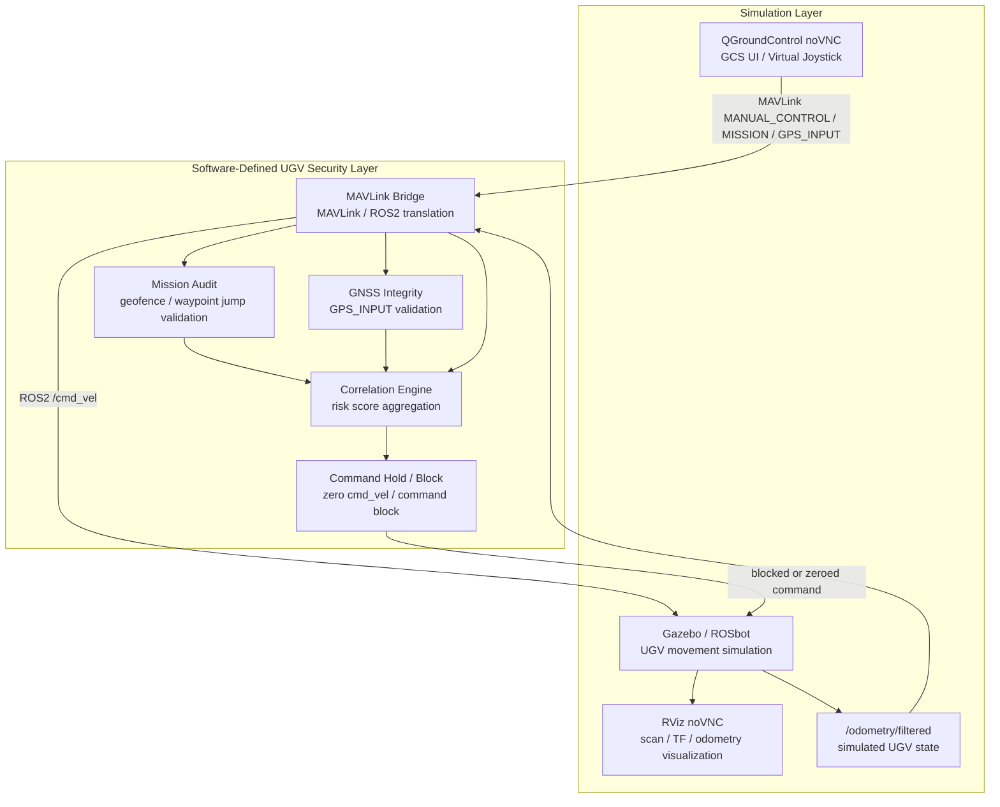

  <strong>🇺🇸 English</strong> | <a href="two_layer_architecture_KR.md">🇰🇷 한국어</a>

# Logical Two-Layer Testbed Architecture

## Purpose

This document explains the DAH 2026 testbed as a logical two-layer architecture for report and evidence alignment.

This testbed is not a replica of an actual military UGV platform. It is a software-defined UGV/GCS cybersecurity testbed that abstracts key operational flows found in defense UGV environments: GCS control, mission upload, GNSS/location input, telemetry feedback, anomaly correlation, and command hold/block response.

## Two-Layer Overview

The Simulation Layer contains the operator-visible and robot-simulation components: QGroundControl noVNC, Gazebo/ROSbot, RViz, and `/odometry/filtered`.

The Software-Defined UGV Security Layer contains the bridge and defense logic: MAVLink Bridge, Mission Audit, GNSS Integrity, Correlation Engine, and Command Hold / Block.

## Layer Responsibilities

| Layer | Components | Responsibility |
| --- | --- | --- |
| Simulation Layer | QGroundControl noVNC, Gazebo/ROSbot, RViz, `/odometry/filtered` | Provides GCS UI, simulated UGV motion, visualization, and odometry feedback. |
| Software-Defined UGV Security Layer | MAVLink Bridge, Mission Audit, GNSS Integrity, Correlation Engine, Command Hold / Block | Translates MAVLink/ROS2 traffic, validates mission and GNSS inputs, correlates anomalies, and blocks unsafe command output. |

## Evidence Mapping

| Day | Evidence Focus | Layer Mapping |
| --- | --- | --- |
| Day3 | Bridge MVP and motion proof | Simulation Layer provides QGC, Gazebo/ROSbot, RViz, and `/odometry/filtered`; Software-Defined UGV Security Layer provides MAVLink Bridge translation and telemetry feedback. |
| Day4 | Mission audit | Simulation Layer provides QGC mission upload context and simulated UGV operational boundary; Software-Defined UGV Security Layer provides Mission Audit geofence, waypoint jump, and MISSION_ACK decisions. |
| Day5 | GNSS integrity | Simulation Layer provides odometry-derived expected UGV position; Software-Defined UGV Security Layer provides GPS_INPUT validation, spoof jump detection, and poor-fix detection. |
| Day6 | Correlation hold/block | Simulation Layer provides the simulated command execution target and odometry feedback; Software-Defined UGV Security Layer provides risk scoring, hold engagement, and command block. |

## Limitations

This is a logical architecture diagram. It does not mean the Docker runtime is physically separated into two isolated network zones. The purpose is to distinguish simulation and visualization components from the Software-Defined UGV Security Layer.

The current testbed does not implement a production autopilot, real-world radio hardware behavior, or long-duration autonomous GNSS fallback. It validates the defense UGV operational flow through a ROSbot-based surrogate platform and evidence logs.
