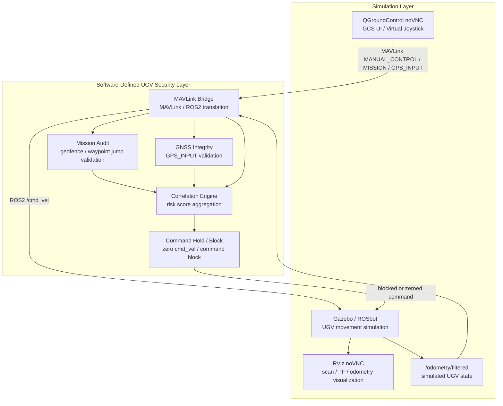

  <a href="two_layer_architecture.md">🇺🇸 English</a> | <strong>🇰🇷 한국어</strong>

# Logical Two-Layer Testbed Architecture

원본: `docs/architecture/two_layer_architecture.md`

## Purpose

이 문서는 DAH 2026 testbed를 보고서와 evidence 정렬을 위한 논리적 2계층 아키텍처로 설명합니다.

이 testbed는 실제 군용 UGV 플랫폼의 복제물이 아닙니다. defense UGV 환경에서 중요한 GCS control, mission upload, GNSS/location input, telemetry feedback, anomaly correlation, command hold/block response를 추상화한 software-defined UGV/GCS cybersecurity testbed입니다.

## Two-Layer Overview

Simulation Layer는 operator-visible UI와 robot simulation component를 포함합니다.

- QGroundControl noVNC
- Gazebo / ROSbot
- RViz noVNC
- `/odometry/filtered`

Software-Defined UGV Security Layer는 bridge와 defense logic을 포함합니다.

- MAVLink Bridge
- Mission Audit
- GNSS Integrity
- Correlation Engine
- Command Hold / Block

## Layer Responsibilities

| Layer | Components | Responsibility |
| --- | --- | --- |
| Simulation Layer | QGroundControl noVNC, Gazebo/ROSbot, RViz, `/odometry/filtered` | GCS UI, simulated UGV motion, visualization, odometry feedback 제공 |
| Software-Defined UGV Security Layer | MAVLink Bridge, Mission Audit, GNSS Integrity, Correlation Engine, Command Hold / Block | MAVLink/ROS2 traffic 변환, mission/GNSS input 검증, anomaly correlation, unsafe command block |

## Evidence Mapping

| Day | Evidence Focus | Layer Mapping |
| --- | --- | --- |
| Day3 | Bridge MVP and motion proof | Simulation Layer는 QGC/Gazebo/RViz/odometry를 제공하고, Security Layer는 MAVLink Bridge translation과 telemetry feedback을 제공합니다. |
| Day4 | Mission audit | Simulation Layer는 QGC mission upload context와 simulated boundary를 제공하고, Security Layer는 geofence, waypoint jump, MISSION_ACK decision을 제공합니다. |
| Day5 | GNSS integrity | Simulation Layer는 odometry-derived expected UGV position을 제공하고, Security Layer는 GPS_INPUT validation과 spoof/poor-fix detection을 제공합니다. |
| Day6 | Correlation hold/block | Simulation Layer는 command execution target과 odometry feedback을 제공하고, Security Layer는 risk scoring, hold engagement, command block을 제공합니다. |

## Limitations

이 아키텍처는 논리적 구분입니다. Docker runtime이 두 개의 물리적으로 격리된 network zone으로 나뉜다는 의미가 아닙니다.

현재 testbed는 production autopilot, real RF hardware behavior, physical GNSS receiver integration, long-duration autonomous GNSS fallback을 구현하지 않습니다. ROSbot-based surrogate platform과 evidence log를 통해 defense UGV operational flow를 검증합니다.
